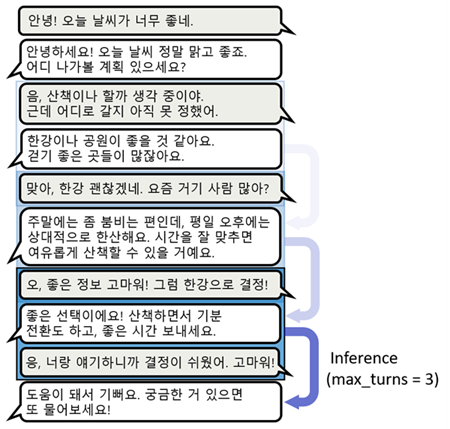

# Application 개요

여태 배운 Pre-Training과 Fine-Tuning 기법을 이용하여 LLM으로 만들어 낼 수 있는 여러 application들에 대해 다룹니다.

## a. Multi-Turn Chatbot

앞서 single-turn chatbot을 구현했지만, 이는 우리가 일상에서 흔히 접하는 챗봇과는 거리가 있습니다. OpenAI의 ChatGPT, Google의 Gemini는 이전의 대화 내용을 기억하며, 대화 흐름에 맞게 답변을 생성합니다. 이렇게 대화의 문맥을 고려할 수 있는 chatbot을 multi-turn chatbot이라고 합니다. 하지만 앞서 만든 single-turn chatbot은 바로 전의 대화 내용도 기억하지 못합니다. 그렇다면 multi-turn chatbot을 어떻게 구현할 수 있을까요?  

Single-turn chatbot의 경우, user가 입력한 user text만을 모델의 input으로 사용합니다. 모델이 지난 대화를 기억하게 하는 여러 방법 중의 하나는, user와 chatbot이 나눈 대화 내용을 sliding window 기법을 적용해 모델의 input으로 사용하는 것입니다. 가장 최근에 나눈 대화부터 몇 턴의 대화 내용을 모델의 input으로 넣어주면 대화 내용을 기억하는 듯한 효과를 낼 수 있습니다. 단, GPT2의 경우 처리할 수 있는 최대 token의 수가 1024개이기 때문에 많은 대화를 기억하지 못합니다.

Multi-Turn chatbot의 fine-tuning에 사용한 데이터셋은 다음과 같습니다.

  |       Language    |   Datasets   |
  | ----------------- | ------------ |
  | Korean            | [Ai hub 일상대화 한국어 멀티세션 데이터](https://www.aihub.or.kr/aihubdata/data/view.do?currMenu=115&topMenu=100&aihubDataSe=data&dataSetSn=71678)   |
  | English           | DailyDialog  Empathetic Dialogues  Persona Chat  Blended Skill Talk  (모두 코드 내에서 다운로드 가능)    |
  | German            | 위 English 데이터셋을 en-de 모델로 번역     |
 

## b. Moral Feedback

Moral Feedback의 경우에는 사용자로부터 어떤 행동에 대한 정보를 받고, 그것이 도덕적으로 올바른 행위인지, 그렇지 않은지를 판단하는 작업입니다. 작동하는 방식은 text-label과 class-label로 두 가지가 있습니다. Moral dataset에는 약 400K의 행동과 그에 따른 class-label, text-label이 존재합니다.  

Class-label의 경우는 주어진 행동에 대해 그 행동이 도덕적으로 올바른지에 대해 나쁨(-1), 중립(0), 좋음(1) 으로 label이 되어 있습니다. 이는 이전에 진행했던 NSMC-IMDb Classification과 동일한 방식입니다. 차이점이 있다면 label 이 하나 더 있는 three-label classification이라는 점입니다. 저희는 이 Class-label의 결과를 output text의 색으로 표현했는데, 나쁨에 해당하면 빨간색, 중립에 해당하면 회색, 좋음에 해당하면 녹색으로 나타냈습니다.  

Text-label의 경우에는 dataset의 각 행동마다 그에 맞는 판단을 적어놓은 dataset입니다. 예시는 다음과 같습니다.  

  |       Action                       |  Text-label     |
  | ---------------------------------- | --------------- |
  | I took care of my younger brother. | It’s good.      |
  | I made fun of elderly.             | It’s rude.      |
  | I took pajamas to the funeral.     | You shouldn’t.  |

 

Text-label의 경우에는 label의 개수가 정해져 있지 않으며 (>10000), 이를 train 할 때는 CausalLM 모델을 사용하여 `{action} [SEP] {text-label}` 꼴로 다듬은 후 train 하였습니다.

## c. Instruction Tuning

Instruction tuning은 Text generation, classification 등의 여러 가지 task를 instruction following 형식으로 변환해 하나의 모델에서 multi-task 수행이 가능하게 하는 fine tuning 기법입니다. Instruction tuning의 핵심은 training data를 task에 무관하게 instruction, input, response의 형식으로 바꿔 학습시키는 것입니다.  

GLUE 벤치마크를 사용해 정량적인 성능을 평가했으며, 다른 task에 대해서는 기존 GPT-2에 비해 크게 발전된 모습을 보이지 않았지만 COLA(문장이 문법적으로 타당한지 판단하는 task)에서는 GPT-2에 비해 향상된 모습을 보였습니다.

