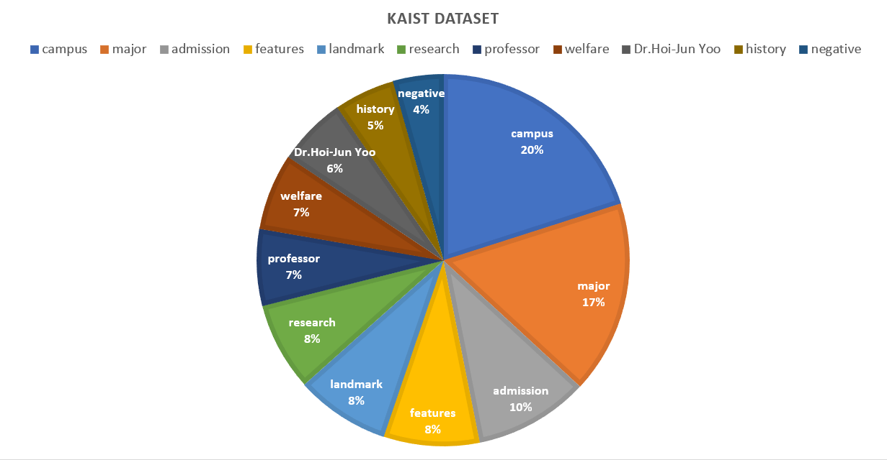

# KAIST Chatbot

## 한국어 멀티세션 데이터 설명

이번에는 이 LLM 튜토리얼의 마지막 목표인 KAIST 챗봇 만들기에 대해 알아보도록 합시다. 저희의 목표는 KAIST에 관련된 정보를 주고 받을 수 있는 Multi-Turn 챗봇 만들기입니다. 기본적인 Training 방식은 이전에 Application에서 다루었던 Multi-Turn Chatbot과 동일합니다. 이번에는 어떻게 KAIST 데이터셋을 구축했는지에 대해서 알아보도록 하겠습니다. 
 

저희가 Multi-Turn 챗봇 만들기를 할 때 사용했던 데이터는 Ai-Hub에 있는 [일상대화 한국어 멀티세션 데이터](https://www.aihub.or.kr/aihubdata/data/view.do?currMenu=115&topMenu=100&dataSetSn=71630) 입니다. 이 때 사용했던 대화의 개수는 약 16000개였고, 대화의 구조는 다음과 같습니다.

1. intro - 대화 시작 인사
2. 첫 번째 주제에 대한 대화
3. interlude - 주제 전환
4. 두 번째 주제에 대한 대화
5. outro - 대화 종료 인사
 

예시는 다음과 같습니다.

#### 1. Intro 및 첫 번째 주제에 대한 대화  
**User:** &nbsp;'몇일 전에 보고 다시 만났네요! 저는 지난번에 신강근 교수에 대한 정보를 얻었는데, 그의 연구분야에 대해 더 알고 싶어요. 무선 네트워킹과 네트워크 보안에 대해 어떤 연구를 진행하고 있는 건가요?'  
**Bot:** &nbsp;&nbsp;&nbsp;'안녕하세요! 신강근 교수는 무선 네트워킹과 네트워크 보안에 대한 연구를 진행 중이십니다. 그는 실생활 애플리케이션에 결과를 적용하는 여러 연구 프로젝트를 진행하고 계시는군요. 예를 들어, 어떤 예제를 들고 싶으신가요?' 
**User:** &nbsp;'실제로 실생활에 적용되는 예제를 알고 싶어요. 어떤 프로젝트가 있을까요?' 
**Bot:** &nbsp;&nbsp;&nbsp;'예를 들어, 신강근 교수는 스마트 홈 시스템을 개발하기 위한 무선 네트워킹 연구를 진행하고 계십니다. 이를 통해 사용자는 스마트폰이나 태블릿을 통해 집안의 다양한 기기를 제어하고 모니터링할 수 있습니다. 이렇게 무선 네트워킹 기술을 활용한 혁신적인 프로젝트들이 많이 진행되고 있습니다.' 
**User:** &nbsp;'그렇군요. 저도 스마트 홈 시스템에 관심이 있어요. 어떤 다른 프로젝트들이 있는지 더 알고 싶어요.' 
**Bot:** &nbsp;&nbsp;&nbsp;'신강근 교수는 무선 네트워크 보안과 관련된 다양한 프로젝트들도 진행하고 있습니다. 예를 들어, 무선 네트워크 통신 중 발생할 수 있는 보안 취약점을 분석하고 대응하는 연구를 진행하고 계십니다. 이를 통해 무선 네트워크 환경에서 안전하게 통신할 수 있도록 도움을 주고 있습니다. 여러분들이 스마트 디바이스를 사용하는데 있어서 더욱 안전하고 신뢰할 수 있는 환경을 만들기 위해 노력하고 있습니다.' 
#### 2. Interlude 없이 두 번째 주제에 대한 대화 
**User:** &nbsp;'국내 스포츠 역사에 대해 진준택이라는 인물에 대해 읽었어요. 더 자세히 알고 싶은데 알려 주실수있나요?' 
**Bot:** &nbsp;&nbsp;&nbsp;'진준택(陳準鐸, 1949년 5월 17일 ~ )은 전 대한민국의 배구 선수이자 전 인천 대한항공 점보스의 총감독이며, 대한민국 프로농구 전주 KCC 이지스의 선수로 활약했던 진상원(현재 연세대 농구부 코치)의 아버지이기도 합니다. 진준택 감독의 활약이 궁금하지 않으세요?' 
**User:** &nbsp;'네, 어떤 분이셨나요? 본인은 배구 선수이자 감독이었고 아들은 농구 선수였다가 감독을 하고 있네요. 부자가 키가 엄청 클 것 같아요.' 
**Bot:** &nbsp;&nbsp;&nbsp;'고려증권 배구단 감독을 역임하여 많은 스타 선수들을 양성하였으며, 1998년 고려증권이 IMF 및 모회사의 부도로 해체된 후에는 동해대학교(현 한중대학교)의 교수 겸 감독을 맡기도 했습니다. 이 이후에는 어떤 활동을 했는지 알려 드릴까요?' 
**User:** &nbsp;'고려증권이 부도되던 시기에 활동을 하셨군요. 동해대학교에서의 감독 이후 어땠나요?' 
**Bot:** &nbsp;&nbsp;&nbsp;'2008년에 인천 대한항공 점보스의 감독으로 취임하여 남자 배구 팀 감독에 복귀했으나, 2009~2010 시즌 중 성적 부진과 건강상의 이유로 일선에서 물러나 신영철 세터 코치에게 감독직을 넘겼습니다. 한국 배구에 대해 이야기 할때 빼놓을 수 없는 감독이 진준택 감독입니다.' 
**User:** &nbsp;'진준택에 대한 토론이 재미있었습니다.' 
**Bot:** &nbsp;&nbsp;&nbsp;'진준택 주제에 대해 이야기하는 것은 제가 즐기는 일이에요. 궁금한 점이나 추가 정보를 요청하실 수 있어요.' 
#### 3. Outro 
**User:** &nbsp;'다른 사람이 제 컴퓨터를 쓰고 싶어하네요, 이제 그만 놀아야겠어요. 다음에 또 이야기해요!' 
**Bot:** &nbsp;&nbsp;&nbsp;'건강하게 지내세요! 다음에 다시 뵐 날을 기대하고 있어요. 언제든 환영합니다. 안녕히 가세요!'

## KAIST Multi-Turn Chat Dataset 구축

이 구조를 이용하여 KAIST를 소개하는 대화를 만들어 내는 것이 저희의 목표입니다. 그래서 대화 시작 인사, 주제 전환, 대화 종료 인사에 대한 format을 만든 다음, 단일 주제에 대한 4~6 turn의 대화를 조합해서 만들어 내는 방식을 사용하였습니다. 대화의 생성 방식은 다음과 같습니다.

1. intro - 6개의 intro 대화 중 random하게 하나를 선택  
2. 첫 번째 주제에 대한 대화 - 200개의 주제  
3. interlude  
    3. 1. interlude - 6개의 interlude (주제 전환 대화 중 random하게 하나를 선택)  
    3. 2. no interlude - 일정 확률로 interlude 연결 없이 주제 전환  
        &nbsp;&nbsp;&nbsp;&nbsp;&nbsp;&nbsp;&nbsp;50% 확률로 '그렇구나' 이후 다음 주제 제시  
        &nbsp;&nbsp;&nbsp;&nbsp;&nbsp;&nbsp;&nbsp;25% 확률로 '그러면,' 이후 다음 주제 제시  
        &nbsp;&nbsp;&nbsp;&nbsp;&nbsp;&nbsp;&nbsp;25% 확률로 아무 도입 없이 다음 주제 제시  
4. 두 번째 주제에 대한 대화 - 첫 번째 주제를 제외, 199개의 주제  
5. outro - 6개의 outro 대화 중 random하게 하나를 선택  

약 200개의 단일 주제에 대한 대화를 구성했으며, 이를 이용하여 생성해 낸 데이터는 200*199 = 39800 개의 dialogue를 사용했습니다. 또한 주제에 대한 대화에서, 특정 질문에만 대답을 한다거나, 같은 내용의 다른 발화 방식으로 질문을 하였을 때 챗봇이 알아듣지 못하는 문제를 방지하기 위해서, 각 대화에 있는 질문을 3개씩 만들어 데이터셋의 다양성을 늘렸습니다. 예를 들자면, 6 turn 대화의 경우에는 3^3 = 27개의 서로 다른 데이터셋이 생성됩니다.  

데이터셋은 KAIST에 대한 10개의 주제와 negative set으로 분류되어 있으며, 각각 담고 있는 정보는 다음과 같습니다.  

**admission** - 입시 
**campus** - KAIST 본원 캠퍼스 내 건물, 교통수단 등에 대한 정보 
**features** - KAIST의 전반적인 특징(학풍, 차별점 등) 
**history** - KAIST의 역사 
**landmark** - KAIST의 문화와 상징적인 건축물 
**major** - 학과에 대한 정보 
**professor** - 일부 교수님들에 대한 정보(연구 분야, 업적 등) 
**research** - KAIST의 최신 연구 성과 
**welfare** - 학부 생활, 복지에 대한 정보 
**Prof. Hoi-Jun Yoo** - 유회준 교수님에 대한 정보 
**negative dataset** - KAIST와 무관하거나 틀린 정보를 사용자가 입력할 경우, 챗봇이 잘못된 응답을 하는 것을 방지하기 위한 데이터셋 
 

**총 dataset 크기(preprocess 전): 253.33KB **

 
 
예시는 다음과 같습니다.

#### 1. Intro 
**User:** &nbsp;"안녕, 뭐 하나 물어봐도 돼?" 
**Bot:** &nbsp;&nbsp;&nbsp;"안녕하세요! 물론이죠. KAIST에 관련해서 어떤 것이 궁금하신가요?" 
#### 2. 첫 번째 주제에 대한 대화 
**User:** &nbsp;"무학과인데 선발을 어떻게 진행하나요?" 
**Bot:** &nbsp;&nbsp;&nbsp;"무학과 선발은 학과 구분 없이 학생을 모집하고, 1년차 2학기 말에 원하는 학과를 신청하게 돼요. 모든 신입생은 1년간 새내기과정학부에 소속되어 기초 과목을 수강하고, 1학년을 마친 후 원하는 학과로 가면 됩니다." 
**User:** &nbsp;"평점이 낮다고 원하는 학과에 들어가지 못하는 일은 없겠군요." 
**Bot:** &nbsp;&nbsp;&nbsp;"네. 그래서 전공에 대한 위화감이 없고, 점수 때문에 원하는 전공을 못하는 일도 없죠. 단, 반도체시스템공학과는 삼성전자와 계약된 학과로, 무학과 선발의 예외입니다." 
#### 3. Interlude 
**User:** &nbsp;"그렇군요. 도움이 많이 되었어요. 감사합니다!" 
**Bot:** &nbsp;&nbsp;&nbsp;"그렇게 말해주시니 감사합니다. 더 궁금한 것이 있으면 질문해주세요!" 
#### 4. 두 번째 주제에 대한 대화 
**User:** &nbsp;"전산과 홈페이지가 어딘지 궁금해." 
**Bot:** &nbsp;&nbsp;&nbsp;"전산학부 홈페이지의 주소는 다음과 같습니다. [cs.kaist.ac.kr]" 
**User:** &nbsp;"전산과 사무실 연락처가 필요해요." 
**Bot:** &nbsp;&nbsp;&nbsp;"전산학부 사무실 연락처와 위치는 다음과 같습니다. E3 정보전자공학동 1402호, 042-350-3502." 
#### 5. Outro 
**User:** &nbsp;"그렇구나. 도움이 많이 되었어." 
**Bot:** &nbsp;&nbsp;&nbsp;"천만에요, 더 궁금하신 것이 있나요?" 
**User:** &nbsp;"아니, 이제 없어." 
**Bot:** &nbsp;&nbsp;&nbsp;"그렇군요. 다음에도 또 찾아주세요!" 

## Optional: KAIST Dataset Pre-Train

초기에 KAIST Chatbot을 만들 때에는 dialogue 데이터셋으로 fine-tuning 하기 전에, KAIST에 관련된 정보, 위키, 기사, 홍보물들에 있는 텍스트를 수집하여 약 25MB 가량의 corpus (kaistdataset.txt)를 만들어 이를 이용하여 pre-train 하였습니다. 하지만 pre-train을 사전에 하지 않고 바로 dialogue 데이터셋으로 fine-tuning 한 모델과 비교했을 때 큰 차이가 없기 때문에 optional로 생각하시면 될 것 같습니다.
